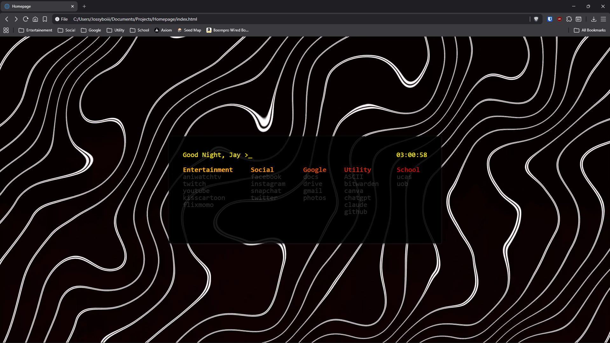

# Custom Homepage

A minimal, terminal-style personal browser homepage built with vanilla HTML, CSS and JS.

## Features

- Time-aware greeting that types itself out on load (good morning / afternoon / evening / good night)
- Custom blinking cursor that hides while typing
- Live clock
- Organised bookmark columns with hover-to-reveal links
- Persistent bookmarks via localStorage — add, rename, reorder and delete links and categories without touching the code
- Drag-and-drop reordering for both categories and links
- Full command interface via the header input

## Commands

| Command | Description |
|---|---|
| `/bookmarks` | Open the bookmark manager |
| `/settings` | Edit your name and background |
| `/calc <expr>` | Evaluate a math expression — supports `+ - * / ^ ( )` |
| `/timer <minutes>` | Start a countdown timer with a progress bar |
| `/timer stop` | Stop the active timer |
| `/export` | Download your current config as `data.json` |
| `/import` | Load a previously exported `data.json` |
| `/reset` | Reset bookmarks and settings to defaults |

## Setup

1. Clone or download the repo
2. Install the [Custom New Tab URL](https://chrome.google.com/webstore/detail/custom-new-tab-url/mijlfebflfgnpbpkingmkgkigckkpbll) Chrome extension
3. In the extension settings, set the URL to the path of `index.html` on your machine — e.g. `file:///C:/Users/yourname/Documents/GitHub/Custom-Homepage/index.html`
5. Add a background video or image to `assets/` and name it `background.mp4` (or set a custom URL via `/settings`)
5. Open a new tab — your homepage should load

## Config & Storage

All bookmarks and settings are stored in `localStorage` under the extension's origin. On first load, the built-in defaults from `script.js` are seeded automatically — no setup required.

To back up or sync your config across machines:

- `/export` — downloads your current state as `data.json`
- `/import` — loads a `data.json` and applies it immediately
- `/reset` — reverts to the default 5-link layout baked into `script.js`
